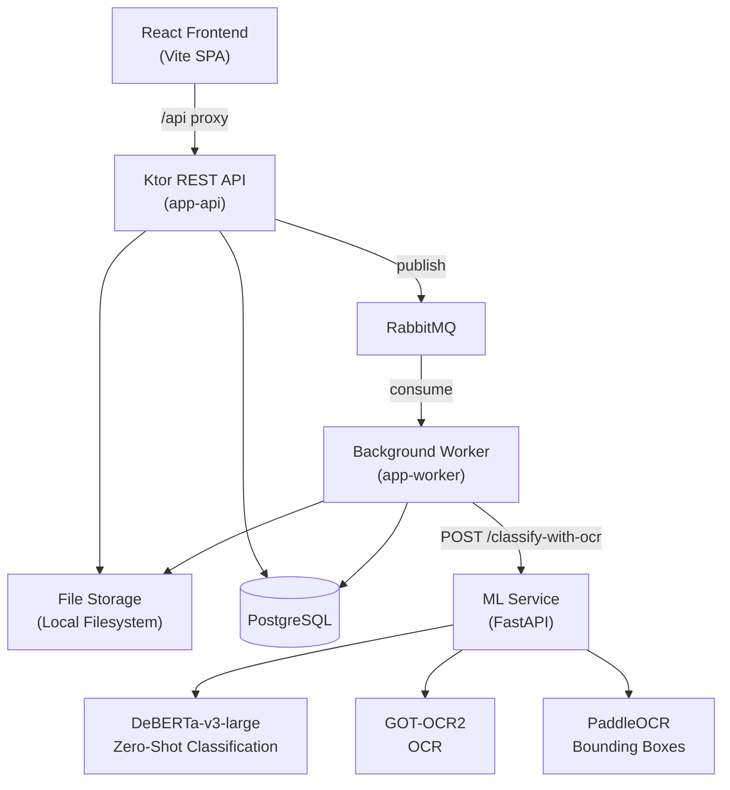

# Document Pipeline

A multi-module Kotlin document ingestion service. Accepts document uploads (PDF, images, text) via REST API, stores files locally, persists metadata in PostgreSQL, and dispatches async classification jobs through RabbitMQ to a worker that calls an ML service for zero-shot classification and OCR.

Includes a React SPA frontend with rich document viewers, a Python FastAPI ML service with GPU-accelerated classification and OCR, and a single-command dev environment.

## Architecture



### Data Flow

1. **Upload** — User uploads a document via the frontend or REST API
2. **Store** — API saves the file to local storage and metadata to PostgreSQL
3. **Queue** — API publishes a message to RabbitMQ for async processing
4. **Process** — Worker consumes the message, retrieves the file, calls the ML service
5. **Classify + OCR** — ML service runs zero-shot classification (DeBERTa-v3-large) and OCR (GOT-OCR2) with bounding box detection (PaddleOCR)
6. **Update** — Worker stores OCR results as a JSON file and updates the document record with classification + OCR path
7. **View** — Frontend displays classification, document preview, OCR text, and bounding box overlays

## Quick Start

### Prerequisites

- JDK 21+
- Docker & Docker Compose
- Node.js 18+ and npm (for frontend)
- NVIDIA GPU with CUDA 12.x (for ML service; optional — pipeline works without it)

### One Command

```bash
./scripts/dev.sh
```

Starts everything: Docker infrastructure (PostgreSQL, RabbitMQ, ML service), the Ktor API, the background worker, and the Vite frontend dev server. Output is prefixed with `[infra]`, `[api]`, `[worker]`, `[ui]`, and `[ml]` labels. Press Ctrl+C to stop.

```bash
./scripts/dev.sh --stop       # Stop all processes + Docker containers (preserves images/volumes)
./scripts/dev.sh --destroy    # Stop all + remove Docker containers and volumes
./scripts/dev.sh --restart    # Kill our processes and restart fresh
./scripts/dev.sh --force      # Kill ANY process on our ports, then start fresh
```

### Manual Start

```bash
# 1. Start infrastructure
docker compose -f docker/docker-compose.yml up -d

# 2. Build backend
./gradlew build

# 3. Run API (port 8080) and worker in separate terminals
./gradlew :app-api:run
./gradlew :app-worker:run

# 4. Run frontend (port 5173, proxies /api to localhost:8080)
cd frontend && npm install && npm run dev
```

### Verify

```bash
curl localhost:8080/api/documents        # API
curl localhost:8000/health               # ML service
curl localhost:15672                      # RabbitMQ management UI
```

## Module Structure

| Module | Description |
|---|---|
| `core-domain` | Domain models (`Document`, `ClassificationResult`) and interfaces — zero framework deps |
| `infra-db` | PostgreSQL via Exposed DSL, Flyway migrations, HikariCP connection pool |
| `infra-storage` | Local file storage with date-based paths and path traversal protection |
| `infra-queue` | RabbitMQ publisher + consumer with topic exchange and dead-letter queue |
| `app-api` | Ktor HTTP server — REST endpoints, multipart upload, CORS, file size limits |
| `app-worker` | Background worker — consumes queue messages, calls ML service, stores OCR results |
| `frontend/` | React SPA — document list, upload, viewers, OCR display, multi-select bulk delete |
| `ml-service/` | Python FastAPI — zero-shot classification, OCR, bounding box detection |
| `scripts/` | Dev environment management (`dev.sh`) |
| `docker/` | Docker Compose for PostgreSQL, RabbitMQ, and ML service |

## API Endpoints

| Method | Endpoint | Description |
|---|---|---|
| `POST` | `/api/documents/upload` | Upload a document (multipart: `file` + optional `uploadedBy`, `metadata.*`) |
| `GET` | `/api/documents` | List documents (`?classification=&limit=&offset=`) |
| `GET` | `/api/documents/search` | Search by metadata (`?metadata.*=&limit=`) |
| `GET` | `/api/documents/{id}` | Get document detail |
| `GET` | `/api/documents/{id}/download` | Download original file |
| `GET` | `/api/documents/{id}/ocr` | Get OCR results JSON (bounding boxes + full text) |
| `DELETE` | `/api/documents/{id}` | Delete document and associated files |
| `POST` | `/api/documents/{id}/retry` | Re-queue document for classification |

## Frontend

React 19 SPA with TanStack Router, TanStack Query, Tailwind CSS v4, and shadcn/ui.

- **Dashboard** — Upload count, classification breakdown
- **Document list** — Filter by classification, multi-select with bulk delete
- **Document detail** — Metadata, classification badge, download, retry, delete
- **Rich viewers** — JSON (`react-json-view-lite`), XML (`react-xml-viewer`), PDF deep zoom (`pdfjs-dist` + `openseadragon`), images, plain text
- **OCR results** — Tabbed viewer with OCR text tab and bounding box overlay on PDF pages
- **Dark/light mode** — Glassmorphism theme with CSS custom properties

## ML Service

Python 3.12 FastAPI service with three models:

| Model | Purpose | VRAM |
|---|---|---|
| DeBERTa-v3-large NLI | Zero-shot document classification | ~870 MB |
| GOT-OCR2 | Text extraction from images/PDFs | ~1.1 GB |
| PaddleOCR | Text region bounding box detection | ~200 MB (CPU) |

First run downloads ~4 GB of model weights from HuggingFace Hub.

For CPU-only mode, set `ML_DEVICE=cpu` and `ML_TORCH_DTYPE=float32` in the environment.

## Tech Stack

**Backend** — Kotlin 2.2, JVM 21, Gradle (Kotlin DSL) with version catalog, Ktor 3.2 (Netty), kotlinx.serialization, Koin DI, Exposed DSL, Flyway, HikariCP, RabbitMQ (amqp-client), Kotlin Coroutines, SLF4J + Logback, HOCON config

**Frontend** — React 19, TypeScript 5, Vite 6, TanStack Router + Query + Form, Tailwind CSS v4, shadcn/ui, pdfjs-dist, openseadragon, Vitest + React Testing Library + MSW, Playwright

**ML Service** — Python 3.12, FastAPI, Uvicorn, Transformers, PyTorch, PaddleOCR, PyMuPDF, Pydantic Settings

**Infrastructure** — PostgreSQL 16, RabbitMQ 4, Docker Compose, NVIDIA CUDA 12.6 (optional)

## Testing

```bash
# Backend (Kotlin) — Kotest + JUnit 5 + Testcontainers + MockK
./gradlew test                         # All modules
./gradlew :infra-db:test               # Single module (infra-db and infra-queue need Docker)

# Frontend — Vitest + React Testing Library + MSW
cd frontend && npm test                # 73 tests across 19 files

# Frontend E2E — Playwright (requires running backend)
cd frontend && npm run test:e2e

# ML service — pytest (all mocked, no GPU needed)
cd ml-service && pip install -e ".[dev]" && pytest tests/ -v

# ML service GPU integration tests (requires CUDA GPU + downloaded models)
cd ml-service && pytest -m gpu -v
```

## Configuration

Both apps use HOCON (`application.conf`) with environment variable overrides. Local dev defaults are baked into Docker Compose and `application.conf` — **override all credentials for production**.

| Variable | Description | Dev default |
|---|---|---|
| `DATABASE_URL` | PostgreSQL JDBC URL | `localhost:5432/document_pipeline` |
| `DATABASE_USERNAME` | Database user | Set in `application.conf` |
| `DATABASE_PASSWORD` | Database password | Set in `application.conf` |
| `RABBITMQ_HOST` | RabbitMQ host | `localhost` |
| `RABBITMQ_PORT` | RabbitMQ port | `5672` |
| `STORAGE_BASE_DIR` | File storage directory | `./document-storage` |
| `ML_SERVICE_URL` | ML classification service URL | `http://localhost:8000` |

ML service uses `ML_`-prefixed env vars: `ML_DEVICE`, `ML_TORCH_DTYPE`, `ML_HF_HOME`, `ML_CANDIDATE_LABELS`, `ML_OCR_MAX_PDF_PAGES`.

## Roadmap

| Pass | Focus | Status |
|---|---|---|
| 1 | Security hardening | Implemented |
| 2 | Document viewers + OCR pipeline | Implemented |
| 3 | Test coverage gaps (E2E, integration, error paths) | Planned |
| 4 | Documentation & code quality (KDoc, error consistency) | Planned |
| 5 | Build & DevEx (Gradle config cache, Docker health checks) | Planned |
| 6 | Observability & logging (Prometheus metrics, correlation IDs) | Planned |
| 7 | Model explainability (per-label scores, attention attribution) | Planned |
| 8 | CI/CD (GitHub Actions, Docker image builds, GHCR) | Planned |
| 9 | Log ingestion & analytics — new Go service with dashboard | Planned |

## License

MIT
